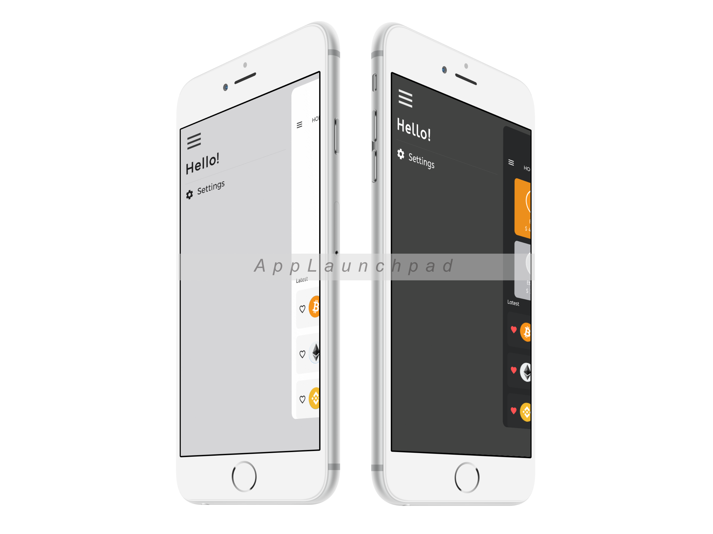
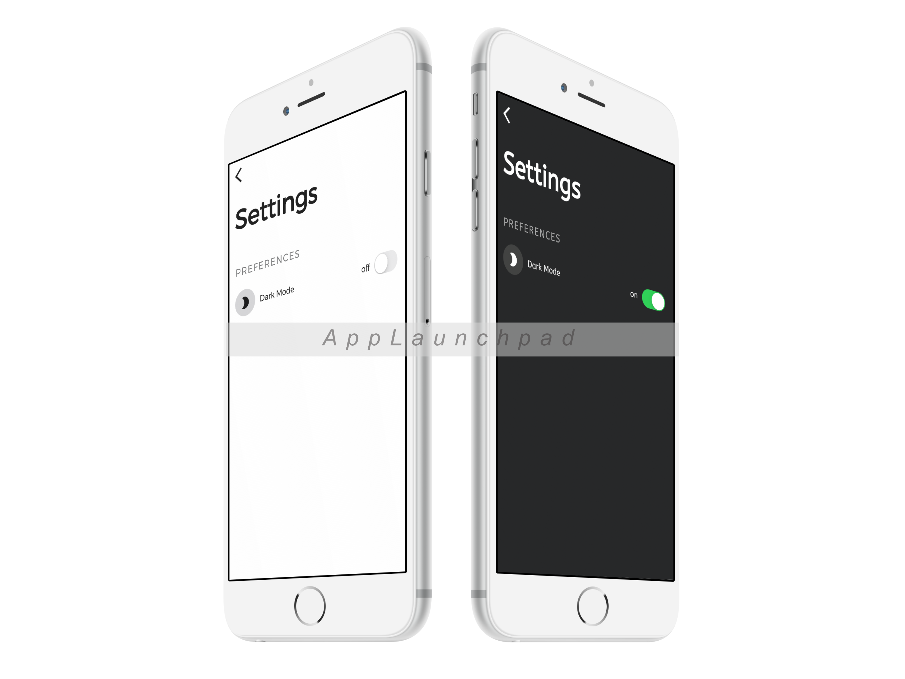

# cryphub

Cryphub is an application that gives you a basic overview of different crypto currencies.

## Getting Started

To run the application create `lib/core/config.dart` and add the following code:
```dart
class _Config {
  const _Config();
  final coinMarketCapApiKey = 'your-api-key';
}

const config = _Config();
```
Get your api key here: https://coinmarketcap.com/api/

To resolve any dependency issues run `flutter pub get` and `flutter pub run build_runner watch --delete-conflicting-outputs`.

## UI
### Home screen without favorites

### Home screen without favorites

### Sidebar

### Settings


